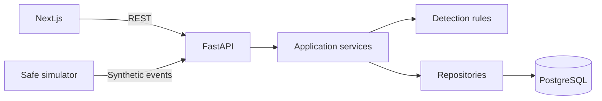

# SentinelAI

SentinelAI is an explainable security monitoring and threat-analysis platform built as a student portfolio project. It will collect synthetic security telemetry, create deterministic alerts, and later add advisory AI, anomaly detection, and grounded security knowledge.

> **Status:** Milestone 0 foundation. Detection, authentication, AI, and ML are intentionally not implemented yet.

## Foundation features

- FastAPI liveness and database-backed readiness endpoints
- Async SQLAlchemy and Alembic foundation for PostgreSQL
- Next.js App Router status interface
- Structured JSON logging and request correlation IDs
- Docker Compose with health-gated service startup
- Locked npm and uv dependencies, automated tests, linting, type checking, and CI
- Security, architecture, database, API, threat-model, and roadmap documentation

## Architecture



The application is a modular monolith. See [docs/ARCHITECTURE.md](docs/ARCHITECTURE.md) for boundaries and decisions.

## Quick start with Docker

Requirements: Docker Engine/Desktop with Compose v2.

```bash
cp .env.example .env
# Replace the placeholder database password in .env and its URL.
docker compose up --build
```

Open the frontend at `http://localhost:3000`, API docs at `http://localhost:8000/docs`, and liveness endpoint at `http://localhost:8000/health/live`.

Stop with `docker compose down`. Use `docker compose down -v` only when intentionally deleting local database data.

## Local development

Backend requires Python 3.11+, uv, and a reachable PostgreSQL database:

```bash
cd backend
uv sync
uv run uvicorn app.main:app --reload
```

Frontend requires Node 22+ and npm:

```bash
cd frontend
npm ci
BACKEND_INTERNAL_URL=http://localhost:8000 npm run dev
```

On PowerShell, set environment variables with `$env:BACKEND_INTERNAL_URL='http://localhost:8000'`.

## Verification

```bash
cd backend
uv run ruff check .
uv run mypy app tests
uv run pytest

cd ../frontend
npm run lint
npm run typecheck
npm test
npm run build
```

## Planned demo

Milestone 1 will provide the first complete flow: start the stack, generate normal events, generate a synthetic brute-force scenario, and inspect the resulting HIGH alert and supporting evidence in the dashboard.

## Security principles

All telemetry is untrusted; AI never creates the initial security alert or performs remediation; secrets remain in environment configuration; backend authorization will be authoritative. See [docs/SECURITY.md](docs/SECURITY.md) and [docs/THREAT_MODEL.md](docs/THREAT_MODEL.md).

## Troubleshooting

- `ready` returns 503: confirm PostgreSQL is healthy and `SENTINEL_DATABASE_URL` is correct.
- Frontend says backend unavailable: confirm the backend is running and `BACKEND_INTERNAL_URL` is reachable from the frontend process.
- Compose cannot bind a port: stop the process using ports 3000, 5432, or 8000, or change the host-side mapping.

## License

MIT. See [LICENSE](LICENSE).
