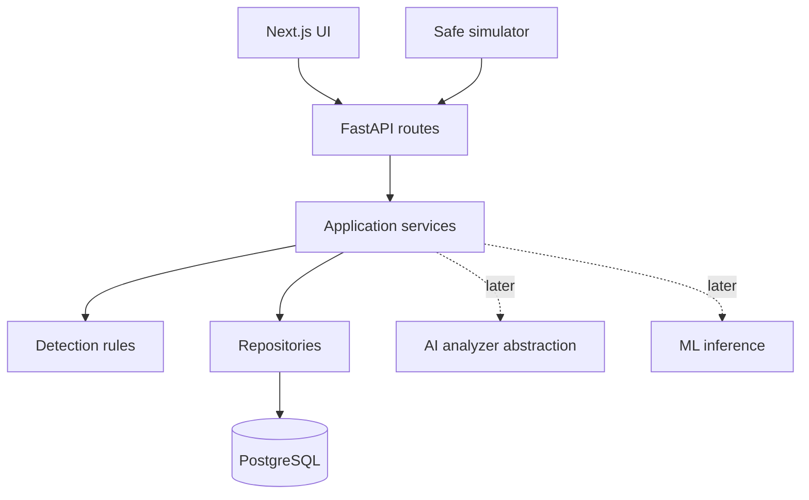

# Architecture

## Detection registry and scoring

Ingestion loads one bounded set of events related by source address or identity for the maximum
configured rule window, then gives each rule only its own time slice. Rules remain synchronous,
deterministic, and independent of HTTP. Active findings deduplicate by rule and subject; closing an
alert releases that identity for a later incident.

Risk scores are explanatory prioritization, not probability. Each score combines a documented
severity base (LOW 20, MEDIUM 45, HIGH 70, CRITICAL 85), up to 10 confidence points, and up to 10
points for evidence volume, capped at 100.

SentinelAI begins as a modular monolith: one FastAPI deployment owns domain behavior and one Next.js deployment owns the interface. PostgreSQL is the only datastore. This keeps transactions, operations, and interview explanations clear while retaining internal service boundaries.

Routes translate HTTP; services own use cases and transactions; repositories own queries; detection rules return typed findings without HTTP knowledge. AI and ML remain advisory. Offline ML training lives outside the runtime backend.

Health endpoints are operational and unversioned. Domain REST endpoints use `/api/v1`. The frontend calls the backend from the server runtime, avoiding broad browser CORS configuration in the foundation.

## Decisions

- **Modular monolith:** fewer failure modes than premature services, with explicit seams for future extraction.
- **Synchronous detection:** deterministic immediate results for the demo; a service boundary permits later durable processing.
- **PostgreSQL:** relational integrity, JSONB telemetry, and future pgvector without a second datastore.
- **Manual refresh before streaming:** WebSockets are unnecessary for the first useful workflow.
