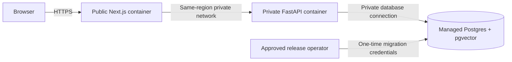

# Milestone 8: cloud deployment design

Reviewed 2026-09-03. Status: design only. No cloud resources, accounts, deployment manifests,
or paid services have been created. Approval of this document is not approval to spend money.
Prices below are USD before tax, currency conversion, domain registration, and variable charges.

## Decision and comparison

Select Render for the first small, always-on portfolio deployment: a public Next.js container,
a private FastAPI container, and managed Render Postgres with pgvector. This is a design selection,
not a provisioning request. Keep local Docker as the zero-hosting-cost option.

| Option | Cost basis | Tradeoff for Sentinel |
|---|---|---|
| Render containers + managed Postgres (selected) | Indicative $20.30/month small-instance baseline below | Predictable compute; private backend; managed database recovery; no HA assumed |
| Railway containers + PostgreSQL template | $5 monthly minimum credited toward metered usage | Potentially cheaper at low utilization, but template database maintenance remains ours |
| Local Docker | No cloud hosting bill | Suitable for recordings and interviews, not a publicly available URL |

Render lists its legacy Starter application size at $7/month and Standard at $25/month.
These correspond to 512 MiB-class and 2 GiB-class application instances, respectively.
[Provider comparison and rates](https://render.com/articles/render-vs-railway).
Current plan IDs are `0.5c-512mb` and `1c-2g`; Render says the naming update did not change
existing prices. [Compute plans](https://render.com/docs/compute-plans).

Render's July 2026 example puts one Starter app plus its smallest paid database at about $13/month.
Adding a second $7 application instance and 1 GB database storage at $0.30/GB-month gives an
**indicative $20.30/month baseline**. This is an inference from published examples, not a verified
checkout quote: the dynamic pricing page did not expose its complete current table during review.
Confirm each line item in the account before approval. Propose a $30/month planning budget, not a
guaranteed billing cap. Moving only the backend from $7 to $25 adds $18/month and requires a new
budget decision. [Render cost guide](https://render.com/articles/how-much-does-cloud-application-hosting-cost-for-small-businesses),
[pricing](https://render.com/pricing).

Railway currently lists memory at $0.00000386/GB-second, CPU at $0.00000772/vCPU-second,
volume storage at $0.00000006/GB-second, and service egress at $0.05/GB. An illustrative 30-day
workload averaging 1.25 GB RAM, 0.1 vCPU, 1 GB volume, and 10 GB egress totals about $15.16;
the $5 Hobby minimum is not an additional $5 on top. These are assumed utilization values,
not measured hosting costs. [Railway pricing](https://railway.com/pricing).
Its PostgreSQL templates are explicitly unmanaged: backups, access controls, monitoring, and
maintenance remain the operator's responsibility. This is why the apparently cheaper alternative
is not selected for the managed-database requirement. [Railway database responsibilities](https://docs.railway.com/databases).

## Intended topology

Use one region and workspace for all three services, with a North American region selected at
approval after checking availability and residency requirements. Only the frontend should have a
public hostname. Disable external database access except a temporary, explicitly authorized
administrative exception. Private networking is not an application authorization boundary:
retain RBAC on every domain route and isolate unrelated workloads from the project.
[Private networking](https://render.com/docs/private-network),
[private services](https://render.com/docs/private-services).

Use managed TLS on the public frontend; verify HTTPS redirects, certificates, and HSTS there.
Render provides managed TLS certificates. [TLS documentation](https://render.com/docs/tls).
Do not assume private HTTP is encrypted end to end. Use only synthetic demo data until transport
requirements are reviewed; configure verified database TLS with an asyncpg-compatible SSL context
before handling sensitive telemetry. Do not blindly append libpq-only URL parameters to asyncpg.

## Sizing and cost controls

Initial candidate sizes are one 512 MB application instance per service and the smallest paid
Postgres compute tier, with 1 GB storage if available. A local idle snapshot measured about 37 MiB
frontend, 149 MiB backend, and 41 MiB Postgres. These are idle local observations, not cloud capacity
guarantees. Test concurrent Argon2 logins, ML loading, ingestion, and vector queries under actual
container limits before selecting final sizes. Keep at least 30% memory headroom during the demo.

Keep one backend process and one replica: the current limiter is process-local. Browser requests
share the frontend proxy's quota. Preserve that conservative behavior until an authenticated-user
or gateway limiter is designed; do not trust arbitrary forwarded addresses to improve quotas.
No autoscaling, preview environments, extra workers, or paid AI/embedding adapters initially.
Monitor storage weekly and billing daily during the first week. Alerts at 50/80/100% of the approved
budget are operator targets, not provider-enforced spending stops. Include builds, bandwidth,
temporary recovery databases, and workspace fees in the final estimate. Never delete databases
automatically to control spend.

## Secrets, identities, and database roles

Store the JWT secret and database credentials only in the provider secret store. Generate new
production values; never reuse the local admin password, development secret, or test database
credentials. Require production mode and secure refresh cookies. Leave CORS empty for the
same-origin frontend proxy. Keep proxy trust empty unless an explicit validated proxy design exists.
Configure the frontend's internal backend URL using the assigned private service address.

Use a migration role for schema changes and a separate least-privileged runtime role with required
table/sequence access and no schema creation rights. Install the supported vector extension once
through the migration role. [Supported extensions](https://render.com/docs/postgresql-extensions).
Bootstrap the administrator through the existing interactive CLI in an authorized service shell;
disable shared accounts and create a dedicated read-only demo viewer. Do not put login credentials
in README files, screenshots, scripts, or logs.

## Release and migration procedure

1. Review GitHub CI, CodeQL, dependency, secret, and image scan results. Milestone 7 hosted results
   have not been verified; local test success does not waive this gate.
2. Build backend/frontend images from the same reviewed commit and record immutable image digests.
3. Verify a recoverable database backup and run the full migration chain against an isolated test DB.
4. Run Alembic upgrade once through a controlled release step with migration credentials, then
   run the schema-drift check. Do not run migrations independently in every replica startup.
5. Start the backend using only runtime credentials, then the frontend. Keep the previous image
   digests available. Render supports pre-deploy commands for paid services, but credential separation
   may require a separately controlled release step. [Deploy lifecycle](https://render.com/docs/deploys).
6. Check backend liveness/readiness privately, public login/session restoration/logout, role denial,
   body caps, throttling, alert evidence, and attributed knowledge retrieval. Only then share the URL.

This document intentionally does not create `render.yaml`, cloud environment files, or deployment
automation. Those require the user's explicit configuration approval and a final reviewed quote.

## Health, logs, backups, and rollback

Use `/health/live` for process checks and `/health/ready` for database-backed readiness.
Add a dedicated frontend health endpoint before provisioning; the current page's HTTP 200 alone
does not prove backend connectivity. Check how the selected service type supports private health
probes and alert on failed readiness, repeated 5xx, memory pressure, and database saturation.
Keep structured stdout logs and correlation IDs; exclude tokens, cookies, passwords, full prompts,
request bodies, and unnecessary telemetry. Define retention and access with the account owner.

Paid Render Postgres supports point-in-time recovery; the documented Hobby window is three days
and Pro-or-higher is seven days. Recovery creates a separate database to validate before switching
connections. [Backup and recovery](https://render.com/docs/postgresql-backups).
Proposed demo recovery objectives: RPO at most 24 hours, RTO at most four hours. These are targets,
not tested guarantees. Practice restoring to an isolated instance, checking row counts and evidence
links, and switching credentials. Budget for temporary overlap. Obtain approval before exporting
data to any external backup destination; encrypt and restrict any approved export.

For an application regression, redeploy the recorded previous image only if the schema remains
compatible. Prefer additive migrations and roll-forward fixes. Do not automatically downgrade or
restore the database: restoration can lose writes and needs an explicit incident decision.

## Approval gate and remaining work

Before implementation/provisioning, obtain agreement on Render, region, final monthly estimate,
budget ceiling, domain choice, and whether the next authorization covers configuration only or
actual paid resource creation. Separately complete: hosted scan review, constrained-load testing,
frontend health/HSTS, database TLS and role separation, backup restore rehearsal, and public session
verification. Keep the simulator local-only; do not widen its allowlist as part of deployment.
No cloud account access, payment, deployment, or operational readiness is claimed by this milestone.
