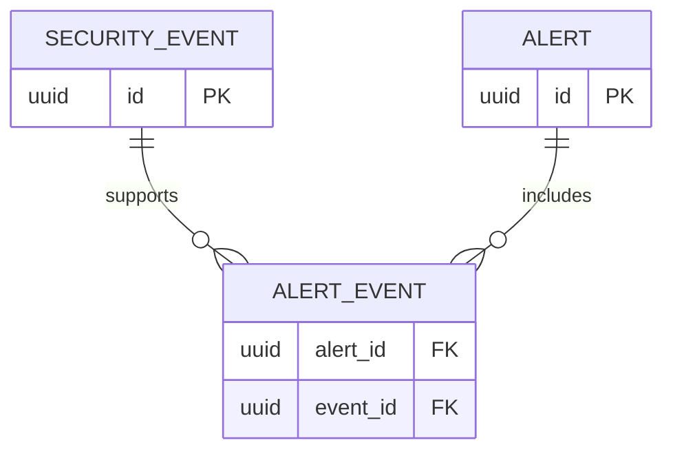

# Database

Milestone 0 configures async SQLAlchemy, Alembic, and PostgreSQL but intentionally creates no domain tables. Every schema change must be represented by an Alembic migration and tested from an empty database.

Planned Milestone 1 relationships:

Externally exposed entities use UUIDs and UTC timestamps. Alert evidence links will have a composite uniqueness constraint. JSONB event metadata will be size-bounded and treated as untrusted.
