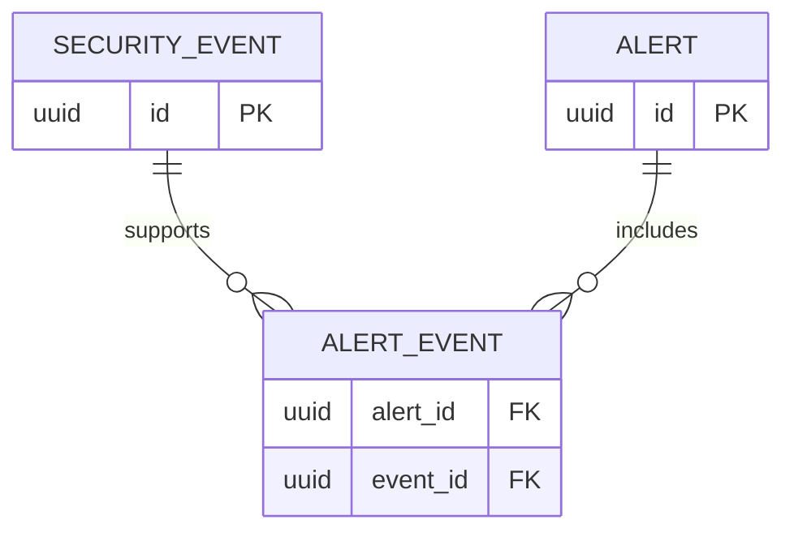

# Database

`anomaly_scores` has a one-to-one relationship with `security_events` and records the bounded score,
advisory anomaly flag, model version, and feature-schema version. It is intentionally separate from
alerts: deterministic rules remain the only alert source.

`knowledge_entries` records source attribution, authorization type, raw approved content, ingestion
actor, and timestamp. `knowledge_chunks` stores bounded text chunks and 64-dimensional local embeddings.
The `vector` PostgreSQL extension supports cosine-distance retrieval; no second datastore is required.

Milestone 1 creates the core security tables through Alembic. Every schema change must be represented by a migration and tested from an empty database.

Core relationships:

Externally exposed entities use UUIDs and UTC timestamps. Alert evidence links will have a composite uniqueness constraint. JSONB event metadata will be size-bounded and treated as untrusted.
